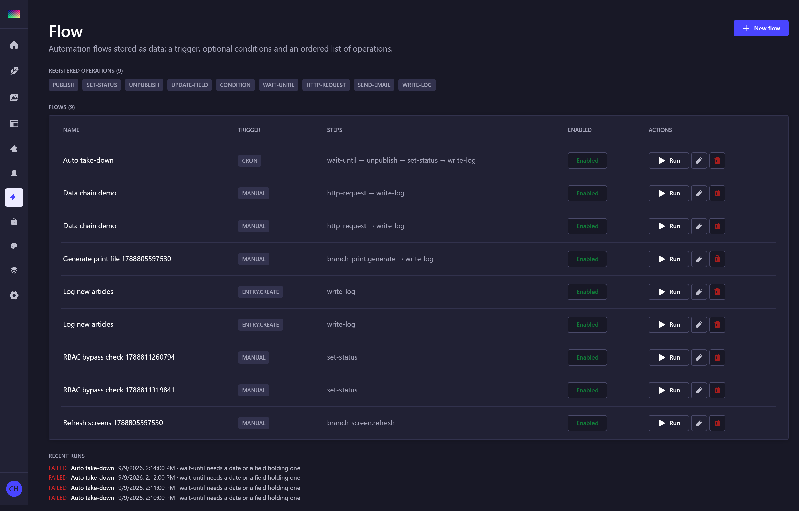
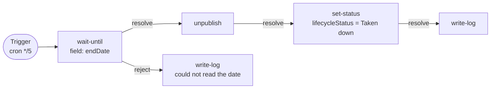
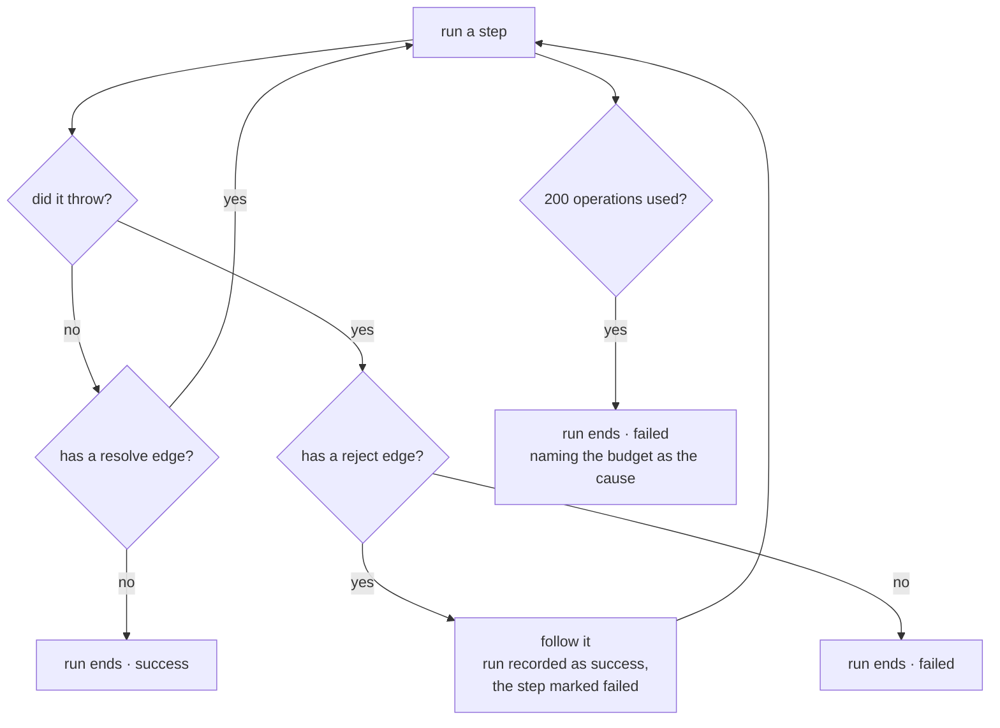

# strapi-plugin-flow

Automation flows for Strapi 5, in the spirit of Directus Flows: a **trigger**, optional
**conditions**, and an ordered list of **operations** that pass data down a chain — all
stored as data, so an automation is created and changed without a deploy.

Flows are built on a **canvas**: panels you drag, connectors you draw, a trigger picked from
a list, and a generated form per operation. Nothing with a finite set of answers is typed by
hand.

Part of [Strapi Content Hub](../../README.md).

## Install

```bash
pnpm add strapi-plugin-flow
```

```ts
// config/plugins.ts
export default {
  'content-hub-flow': { enabled: true, resolve: 'strapi-plugin-flow' },
};
```

## The canvas



The list shows the operations currently registered — including any another plugin contributed —
and, below the flows, the recent runs with the reason for each failure. A run that failed is
part of the record, not something to hide: it is how a broken step is found.

One flow looks like this on the canvas:



Two gestures, and they are different things:

- **Drag a panel** to move it. Positions snap to the grid and are saved with the flow.
- **Drag a handle** — ✓ for success, ✗ for failure — onto another panel to connect it, or
  onto empty space to disconnect.

Clicking a panel opens that operation's form.

### Why you cannot bend a connector

Arrows are **derived from panel positions on every render**, so moving a panel re-routes
everything around whatever is now in its way. Nothing about an edge is stored except which
panel it points at.

Hand-placed waypoints would survive a panel move and leave a line running straight through a
panel, with nothing to say which bends had been deliberate. So a connector's *endpoints* are
editable and its shape is not. This is the approach Directus takes in its own flow editor,
and the reasoning is the same.

The routing itself — orthogonal legs, rounded corners, and a search for a clear lane when
the direct path crosses a panel — lives in [`shared/diagram`](./shared/diagram) and is
unit-tested there. It has three cases: a straight line when both ends are level, one dog-leg
when there is room to the right, and a detour when the target sits level with or *behind* its
parent, which is what keeps a branch drawn backwards readable.

Every choice with a finite set of answers is a dropdown fed by the server:

| Choice | Comes from |
| ------ | ---------- |
| Trigger | The trigger descriptors, each with its own inputs |
| Content-types | What is actually installed |
| Field names | The chosen content-type's own attributes |
| Schedule | Named cron presets — nobody has to recall the field order |
| Workflow stage | The stages that exist, via the workflow plugin |
| Operation | The registry, grouped — including operations other plugins added |

That removes the class of failure a JSON editor invites, where a misspelled key or a step
type that does not exist only surfaces when the flow next fires. Free text remains only
where the value genuinely is open: a URL, a log message, a nested condition group.

### Declaring inputs for your own operation

An operation contributed by another plugin should be no harder to configure than a built-in
one, so `register()` takes field descriptors alongside the handler:

```ts
strapi.plugin('content-hub-flow').service('registry').register({
  type: 'mkt.push',
  label: 'Push to Marketing Automation',
  group: 'Integration',
  fields: [
    { name: 'campaignId', label: 'Campaign', type: 'text', required: true },
    { name: 'uid', label: 'Content-type', type: 'content-type' },
  ],
  handler: async (context, config) => { /* … */ },
});
```

Field types: `text`, `textarea`, `number`, `boolean`, `select` (with `options`),
`content-type`, `field` (offers the selected content-type's attributes), `json`.

## Anatomy of a flow

```jsonc
{
  "name": "Auto take-down",
  "enabled": true,
  "trigger": "cron",
  "triggerConfig": { "cron": "*/5 * * * *", "contentTypes": ["api::article.article"] },
  "conditions": {
    "match": "and",
    "conditions": [{ "field": "lifecycleStatus", "operator": "eq", "value": "Live" }]
  },
  "firstStep": "due",
  "steps": [
    { "id": "due",   "type": "wait-until", "config": { "field": "endDate" },
      "x": 18, "y": 1, "resolve": "down", "reject": "audit" },
    { "id": "down",  "type": "unpublish",  "config": {},
      "x": 35, "y": 1, "resolve": "mark" },
    { "id": "mark",  "type": "set-status", "config": { "field": "lifecycleStatus", "value": "Taken down" },
      "x": 52, "y": 1, "resolve": "audit" },
    { "id": "audit", "type": "write-log",  "config": { "message": "took down {{entry.title}}" },
      "x": 69, "y": 1 }
  ]
}
```

`conditions` uses the condition language in this plugin's own
[`shared/flow.ts`](./shared/flow.ts) — operators, nesting and `getPath` dotted access.

> It used to live in a shared package, whose docstring claimed field-level RBAC evaluated the
> same language "so a rule means the same thing in both plugins". That was not true: this engine
> was the only consumer. The package is gone and the language lives here.

> `conditions` and `steps` are **JSON, not repeatable components**: conditions nest
> (AND/OR groups inside groups) and every operation has a different config shape, neither
> of which a flat Strapi component can express. Both shapes are typed in `shared/flow.ts`.

### Success and failure



Each operation carries two outgoing edges. `resolve` runs next on success; `reject` runs next
on failure.

**A failure with a `reject` edge is a handled failure, not a failed run** — the flow took the
other path, and the run is recorded as a success with the failing step marked `failed` in its
log. Without a `reject` edge the run ends there and is marked failed, exactly as the older
linear engine behaved: later operations assume the earlier ones succeeded, and half-applying
an automation is worse than a clean, logged failure.

Loops are allowed, because a retry edge back into an earlier operation is a reasonable thing
to draw. They are bounded by a budget of **200 operations per run**, and exceeding it is
recorded as a failure naming the cause — a runaway flow should be visible in the log, not
merely absent from it.

### Flows written before the canvas

They keep working, and nothing was migrated. A flow with no positions and no edges is read as
the ordered chain it was written as: each step resolves to the next in the array, laid out
left to right. Opening and saving it makes that layout explicit. A single dragged panel makes
the whole flow explicit, because a half-derived graph would rearrange itself as soon as it
was touched.

## Triggers

| Trigger | Fires when |
| ------- | ---------- |
| `entry.create` / `entry.update` / `entry.publish` / `entry.unpublish` | The matching document-service action runs |
| `stage.changed` | The [content-workflow](../strapi-plugin-content-workflow/README.md) plugin moves an entry |
| `cron` | `triggerConfig.cron` fires (in-process, node-cron) |
| `manual` | Someone presses **Run** in the admin, or calls the run endpoint |
| `webhook` | Reserved — the endpoint is not exposed yet |

Content events are captured by **one global document-service middleware**, not per
content-type subscriptions: which content-types a flow watches is data, so a flow can
start listening to a content-type that did not exist when the server booted.

Dispatch never blocks or fails the write that triggered it — automation is a consequence
of an edit, not part of it.

The `stage.changed` subscription is **optional and one-way**: the engine works without the
workflow plugin, and the workflow plugin has never heard of flows.

## The data chain

Every step receives the same context and writes its return value into it. The next step
reads it through `{{...}}` placeholders:

```jsonc
[
  { "id": "fetch", "type": "http-request", "config": { "url": "https://api.example.com/rate" } },
  { "id": "apply", "type": "update-field", "config": { "data": { "rate": "{{fetch.body.value}}" } } }
]
```

Available in a placeholder: any previous step by its `id`, `$last` (the previous step's
output), `$trigger` (the trigger payload), `entry`, `uid`, `documentId`.

A **whole-string** placeholder keeps the value's type (`"{{fetch.body.value}}"` stays a
number); an embedded one is interpolated as text.

## Built-in operations

| Type | Does |
| ---- | ---- |
| `write-log` | Append a message to the Strapi log and the run output |
| `condition` | Stop the flow unless a condition matches — the run is marked **skipped**, not failed |
| `update-field` | Write one or more fields on the target entry |
| `set-status` | Shorthand for `update-field` on a single field |
| `publish` / `unpublish` | Change the entry's publication state |
| `http-request` | Call an external endpoint; the parsed response enters the chain |
| `send-email` | Send through Strapi's email plugin |
| `wait-until` | Halt while a date is still in the future |

**`wait-until` does not sleep.** An in-process wait would tie up the request and be lost on
restart, so the step *halts* the run and the cron trigger re-evaluates the flow until the
date passes. That is what makes a scheduled take-down survive a deploy.

A failing step follows its `reject` edge if it has one, and otherwise ends the run — see
**Success and failure** above.

## Registering your own operation

```ts
// in your plugin's register() phase
strapi.plugin('content-hub-flow').service('registry').register({
  type: 'mkt.push',
  label: 'Push to Marketing Automation',
  description: 'Send a governed creative to the MA tool',
  handler: async (context, config) => {
    // config placeholders are already resolved
    return { pushed: context.documentId };
  },
});
```

Register in `register()`, not `bootstrap()`: this plugin starts its scheduler in
`bootstrap()`, and a cron flow must never fire against a half-built registry. Any plugin that
contributes an operation should do the same.

## Cron

Schedules run **in-process** via node-cron, so there is nothing extra to deploy. They are
rebuilt from the database on boot and after every flow change, so editing an expression in
the GUI takes effect without a restart. An invalid expression is logged and skipped rather
than taking the scheduler down.

A cron flow scoped to content-types runs **once per published entry**, so `wait-until` can
read that entry's own date. Without scoped content-types it runs once with no target
entry, which suits housekeeping flows.

> Behind more than one instance each replica schedules its own jobs. Run the scheduler on a
> single designated node, or move to an external scheduler.

### Why `destroy()` stops the scheduler

Because leaving it empty cost 7,600 lines of log noise and three wrong diagnoses.

`strapi develop` reloads the application **in-process**: the old instance is destroyed and a new
one built without restarting Node. A `node-cron` task survives that — it lives in the module
registry and knows nothing about Strapi's lifecycle — so every reload left another live job
firing every minute against an instance that no longer existed. The error it produced named
this plugin's flow but pointed at no line of this plugin's code:

```
ReferenceError: strapi is not defined
    at @strapi/core/dist/services/document-service/common.js:1:1
```

That file is Strapi's own `wrapInTransaction`, which reads the **global** `strapi` that a
destroyed instance no longer backs. Two clues would have shortened the hunt: the error count
per minute was not 1 — it equalled the number of leaked instances, so it grew through a working
day — and the stack contained none of this plugin's frames.

`stopAll()` therefore calls `destroy()` on each task rather than `stop()`. Both prevent a task
from firing again, but only `destroy()` removes it from node-cron's module registry, and a
scheduler that rebuilds on every flow save would otherwise leak a task object per save.

## Scripts

| Script | Description |
| ------ | ----------- |
| `pnpm build` | `strapi-plugin build` — admin + server bundles |
| `pnpm dev` | `strapi-plugin watch` |
| `pnpm lint` | Type-check both halves |
| `pnpm test` | 39 tests over the routing geometry and the graph engine |

The connector routing is the part most worth testing: it is pure geometry, and every way it can
be wrong is visible only as a line drawn through a panel.

## Admin API

| Method | Route | Purpose |
| ------ | ----- | ------- |
| GET | `/content-hub-flow/flows` | List flows |
| POST | `/content-hub-flow/flows` | Create |
| PUT | `/content-hub-flow/flows/:id` | Update (reschedules cron) |
| DELETE | `/content-hub-flow/flows/:id` | Delete |
| POST | `/content-hub-flow/flows/:id/run` | Run manually; optional `{ uid, documentId }` target |
| GET | `/content-hub-flow/steps` | Registered operations, including other plugins' |
| GET | `/content-hub-flow/runs` | Recent runs |

## Run log

Every run writes a `flow-run` record — status, the input context, per-step results with
durations, and the error if any. It doubles as the audit trail for everything automation
did. The run records the trigger that **actually** started it, so a manual test of a cron
flow is not logged as a cron firing.

## License

MIT © Suryo Galih Kencana Harianja
